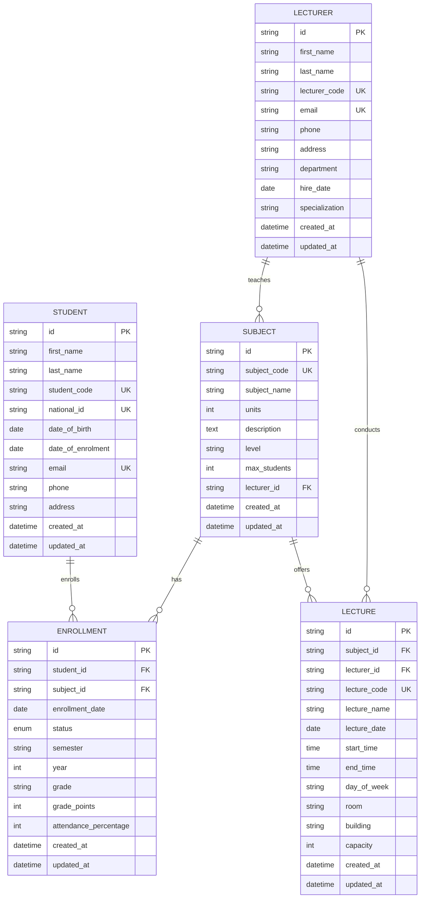

Fixed README.md
markdown
# University Database Management System

## ER Diagram 



## Relationships

| Relationship | Type | Description |
|---|---|---|
| STUDENT → ENROLLMENT | One-to-Many | One student can enroll in many subjects |
| SUBJECT → ENROLLMENT | One-to-Many | One subject can have many students |
| LECTURER → SUBJECT | One-to-Many | One lecturer can teach many subjects |
| SUBJECT → LECTURE | One-to-Many | One subject can have many lectures |
| LECTURER → LECTURE | One-to-Many | One lecturer can conduct many lectures |

# Create a venv instead
python3 -m venv .venv 
source .venv/bin/activate

# 1. Clean everything
docker compose down -v
rm -rf src/migrations/versions/*.py 

# 2. Commands
```
python src/seed.py
python src/main.py
docker compose down -v	   Remove Docker container and data
rm -rf src/migrations/versions/*.py	Delete migration files
docker compose up -d postgres	Start PostgreSQL
alembic revision --autogenerate -m "Initial migration"	Create migration
alembic upgrade head	Apply migration
python src/seed.py	Seed database
python src/main.py	Run queries